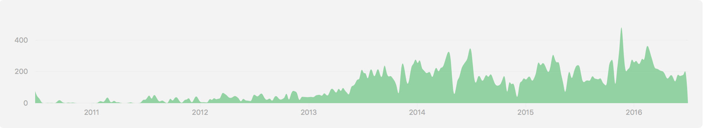

本連載では、Swiftの最新動向中心に述べていくが、その前にこの第1回ではこれまでのSwiftの進化の変遷をなぞっていきたい。
Swift 3は2016年9月頃に正式リリースとなりそうだが、今回はまず現最新版の2.2.1までについて触れていく。

# Swiftとは

そもそも、Swiftが当時Appleからどのように発表されたかを今振り返るとなかなか興味深い。
Swiftは、2014年6月に開催された[WWDC 2014](https://developer.apple.com/videos/wwdc2014/)のKeynoteにて、突如発表された(驚くべきことに事前リーク・予想なども無かった)。

<!--YouTube埋め込み？-->

https://www.youtube.com/watch?v=w87fOAG8fjk&t=1h45m

そこで、以下の4つの特徴を持つ言語として紹介された。

- 高速
- モダン(クロージャー, Optional型, ジェネリクス, 型推論, タプル, …)
- 安全
- インタラクティブ(対話実行環境(REPL), Playgroud)
  
また、Cocoaフレームワーク・ランタイムを共有しており、それまで通り制限無くアプリ開発可能で、Objective-Cコードとの混在も出来ることなどが強調された。

Swiftは、この発表直後から洗練された言語仕様などから大きな注目を集めたが、そこから現時点で2年ほどの短期間で大きな進化を遂げている。

# Swift 2.2までの進化の変遷

これまで短いスパンで様々な改善が繰り返されてきたが、その説明のためにも、現時点での正式版最新の2.2.1までの進化の変遷をざっと見てみよう。

## Swiftリリース以前

WWDC 2014での発表前に水面下でSwiftの開発がなされていた。

- 2010年半ば: Swiftの開発開始
- 2010年7月17日: [Swiftレポジトリへのファーストコミット](https://github.com/apple/swift/commit/18844bc65229786b96b89a9fc7739c0fc897905e)
- 2013年7月にSwiftの開発がApple開発ツールチームの主要目標となる

[Latter氏](https://github.com/lattner)が2010年にファーストコミットした記録が残っている。
[Latter氏のブログ](http://nondot.org/sabre/)には、初めは1〜数人程度の小規模で開発が進められ、Objective-C・Rust・Haskell・Ruby・Python・C#・CLUなどの言語が参考にされたことなどが記載されている。

[Swiftのコミットグラフ](https://github.com/apple/swift/graphs/contributors):

## 2014年6月2日:  WWDC 2014にてSwiftの発表・ベータ版公開

そうして、WWDC 2014にてSwiftのベータ版が発表された。
丁寧なドキュメントが、Appleのサイト・iBooksなどで同時公開され、Keynoteやセッションで紹介しきれていない細かい仕様も把握出来、素晴らしい言語仕様などが評判を集めた(Objective-Cへの不満が多かった反動も大きい)。
すぐに実際のアプリを書き始められる状態であったものの、当時は少し書くだけでコンパイラやXcodeがクラッシュしてしまうようなことも頻発しており、開発者はかなり苦労させられた。

この時期、9月の正式リリースまでは、バグ修正や言語仕様の細かい調整などがなされた。

[koher](http://qiita.com/koher)さんの以下の記事など、地味ながらドラスティックな調整がなされた経緯など見受けられ、今振り返っても興味深い。

- [SwiftのArrayがヤバイ](http://qiita.com/koher/items/6f54eafac59793e7c364)(beta 2の段階)
- [SwiftのArrayが実はすばらしかった](http://qiita.com/koher/items/47f444200d4e02b6414e)(beta 3の段階)

また、[beta 4にてアクセス修飾子](https://developer.apple.com/swift/blog/?id=5)が導入されたことも印象に強く残っている。
当初この仕様が欠けていたため、Swiftはこれを不要とみなしたのかと推測したが、単に間に合わなかっただけのようである。
Swiftはまだまだ発展途中の言語であると改めて認識させられ、その成長に付き合う必要があり、またそれが楽しみと思うようになった。

## 2014年9月15日: Swift 1.0・Xcode 6の正式版リリース

そうしてベータ版のバージョンアップが重なるにつれて、段々とまともに動くようになってきた中、毎年恒例の9月のAppleのイベントにて正式版リリースが発表され、晴れて9月15日にSwift 1.0正式版がリリースされた。

同年10月15日にSwift 1.1・Xcode 6.1がリリースされ、[Failable Initializer(初期化失敗時にnilが返る)の導入](https://developer.apple.com/swift/blog/?id=17)など細かい改善はあったが、こちらも安定性の向上がメインのアップデートで、言語仕様の目立った変更は少なめとなっていた(とはいえ特にOptional型周りの細かい調整などの破壊的変更は繰り返されていたが)。

## 2015年4月8日: Swift 1.2・Xcode 6.3の正式版リリース

Swift 1.1系までで、動作がかなり安定してきたこともあり、1.2以降は盛んに仕様改善・機能改善が行われるようになってきた。
Swift 1.2ではメジャーアップデートで無いにも関わらず、主に以下のような[たくさんの改善が施された](https://developer.apple.com/swift/blog/?id=22)。

- ビルドの高速化
  - Swiftへの不満点として、安定性の次に挙げられていたビルドの遅さが、差分ビルドなどによってかなり改善された
- `if-let`構文で、複数のオプショナル型の値のアンラップがサポート
  - それまでは値の個数分`if-let`のネストが必要だった
- ダウンキャストの結果がオプショナル型になった
- letで宣言した値のセットが、利用の直前まで許容されるようになった
- NSStringからStringなどへの暗黙キャストの廃止
- Objective-Cで`nullable`(Swiftから見た時にオプショナル型になる)など宣言可能に
- Classのメソッド・プロパティを、staticで宣言可能に
- @noescape属性の追加
- Setデータ型の追加
  - それまではNSSetでしのいできたが、Generics機能を使って型付きでSwiftらしく扱えるようになった

列挙している項目の詳細は、ここではその把握というより、主要なものを掻い摘まんでもこれだけのボリュームがあることを示したい、というのが主目的である(一部今後の連載で補足していく予定である)。

## 2015年9月15日: Swift 2.0・Xcode 7の正式版リリース

2015年6月には、[WWDC 2015でSwift 2.0が発表され](https://developer.apple.com/swift/blog/?id=29)、またこの時あとで詳しく述べるオープンソース化を年末に予定していることがアナウンスされた。
そうしてSwift 2.0は、1の時と同じく[同年9月に正式リリースされた](https://developer.apple.com/swift/blog/?id=32)。
ちょうど1年で初のメジャーアップと、かなり早いスピードで進化を遂げていることが分かる。

Swift 2.0での主な改善は以下の通りである。

- try, throw, catchによるエラーハンドリング
  - それまでこの仕様無しで済んでおり、Optional型を利用したいわゆる`Either型`などで補うのでは？と思われていたので意外な仕様追加であった
  - [Swift 2.0 の try, catch ファーストインプレッション](http://qiita.com/koher/items/0c60b13ff0fe93220210)に詳しい考察がある
- #availableステートメント
  - OSやそのバージョンでの条件分岐をコンパイラーレベルで確実に行えるように
- repeat-whileステートメント
  - C言語などでお馴染みの`do-while`と同様の構文
- Protocol extension
  - それまでは必要なプロパティー・メソッドの羅列しか出来なかったが、デフォルト実装を与えられるように
  - 標準ライブラリもその影響を受け、変更があった
- deferステートメント
  - Go言語などでお馴染みの、スコープを抜ける時に確実に実行される処理を記述出来るようにする構文
- guardステートメント
  - オプショナル型をアンラップしつつ、nilだった時に早期returnをする構文
- パターンマッチングの強化
- Enum型のGenerics対応

同年10月20日に細かい変更を含んだSwift 2.1・Xcode 7.1の正式版がリリースされた。

## 2015年12月3日: GitHubでSwiftをオープンソース公開

WWDC 2015年で年末と予告されていた通り、同年12月3日に[Swiftがオープンソースとして公開](https://github.com/apple/swift/)された(ライセンスはApache License 2.0)。
Swiftレポジトリへのスターが1日で10,000を超えるなど、大変高い注目を集めた。

主に次のレポジトリから構成されていて、多くの機能が含まれていることが分かる。

- コンパイラ([clang](https://github.com/apple/swift-clang)・[llvm](https://github.com/apple/swift-llvm))
  - 参考: [Compiler Architecture](https://swift.org/compiler-stdlib/#compiler-architecture)
- [標準ライブラリ](https://github.com/apple/swift)
  - [SourceKit](https://github.com/apple/swift/tree/master/tools/SourceKit)というIDE機能用のフレームワークなども含まれる
- コアライブラリ([Foundation](https://github.com/apple/swift-corelibs-foundation)・[XCTest](https://github.com/apple/swift-corelibs-xctest)・[libdispatch](https://github.com/apple/swift-corelibs-libdispatch)）
- [Swift Evolution](https://github.com/apple/swift-evolution)
  - 今後のSwift言語の変更・提案などをまとめる場(議論は[メーリングリスト](https://lists.swift.org/mailman/listinfo/swift-evolution)にて)
- [パッケージマネージャー](https://github.com/apple/swift-package-manager)

その他、細かいことはオープンソース化と同時に公開された[swift.org](https://swift.org/)に掲載されている。

これでmacOS以外でのプラットフォームでの動作も可能となり、まずはLinux(Ubuntu)上で動くバイナリが提供された。
さらに実際に、2016年2月22日IBMがSwiftのクラウドサービス[Bluemix](https://developer.ibm.com/swift/)・Webフレームワーク[Kitura](https://github.com/IBM-Swift/Kitura)を発表・公開し、実際にその成果が活用されつつある。

## 2016年3月21日: Swift 2.2・Xcode 7.2の正式版リリース

そして2016年3月21日、オープンソース化後初となるバージョンの[Swift 2.2がリリースされた](https://swift.org/blog/swift-2-2-released/)。
その中でも分かりやすいものとしては以下のような変更があった。

- [#selectorの導入](https://github.com/apple/swift-evolution/blob/master/proposals/0022-objc-selectors.md)
  - Selector指定が文字列では無くタイプセーフに行えるように
- [Swiftバージョンによる処理分岐構文の導入](https://github.com/apple/swift-evolution/blob/master/proposals/0020-if-swift-version.md)
- [++・--記法が非推奨に](https://github.com/apple/swift-evolution/blob/master/proposals/0004-remove-pre-post-inc-decrement.md)
- [Cスタイルのforステートメントが非推奨に](https://github.com/apple/swift-evolution/blob/master/proposals/0007-remove-c-style-for-loops.md)
- [`__FILE__`などが非推奨に(`#file`などに変更)](https://github.com/apple/swift-evolution/blob/e4328889a9643100177aef19f6f428855c5d0cf2/proposals/0028-modernizing-debug-identifiers.md)

全てに[GitHubのProposal](https://github.com/apple/swift-evolution/tree/master/proposals)へのリンクを貼ってある通り、実際にGitHubを通じたバグ修正・機能追加が反映されていることが分かる。Swiftの開発への貢献の仕方は[swift.orgのContributingの章](https://swift.org/contributing/)に詳しく記載されている。

また目立つのが、非推奨になった仕様である。
これまでは、バージョンアップの度にコンパイルエラーが発生するような変更が多かったが、2.2では3で予定されている仕様変更の前に緩やかに警告で追従を促すように変わり、Swiftが安定へ向かっていることが伺える。

その後マイナーアップデートがあり、2.2.1が2016年7月現在の最新である。

# まとめ

と、ここまでで実質2年ほどに渡るSwiftの変遷を見てきた。紹介しきれなかった細かい変更点は[CHANGELOG](https://github.com/openstack/swift/blob/master/CHANGELOG)に全て載っている。

オープンソース前は、Swiftの言語仕様は素晴らしいものの、バージョンアップの度に変化がありすぎることやその開発フローがブラックボックスであることなどで今後Swiftがどうなっていくのか見えにくいところがあった。
一方、オープンソース化で期待以上に多くのリソースが公開され、メーリングリスト・GitHubを介したオープンな議論が見えることで、調べさえすればSwiftの今も未来も把握出来るようになった。

オープンソース化のタイミングでSwift 3のロードマップが公開され、9月頃リリースに向けて着々と開発が進んでいるが、第2回ではそのあたりの動向を分かりやすく紹介していく。