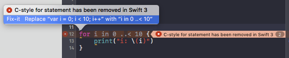
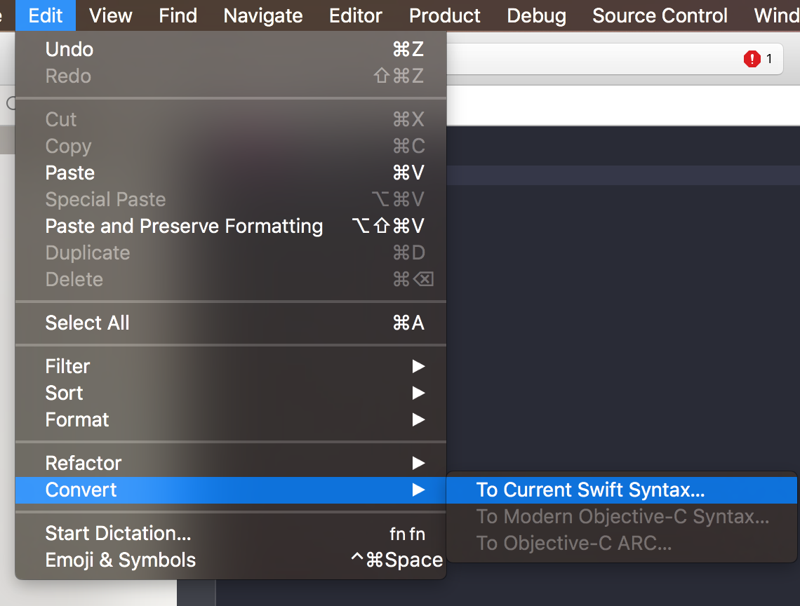
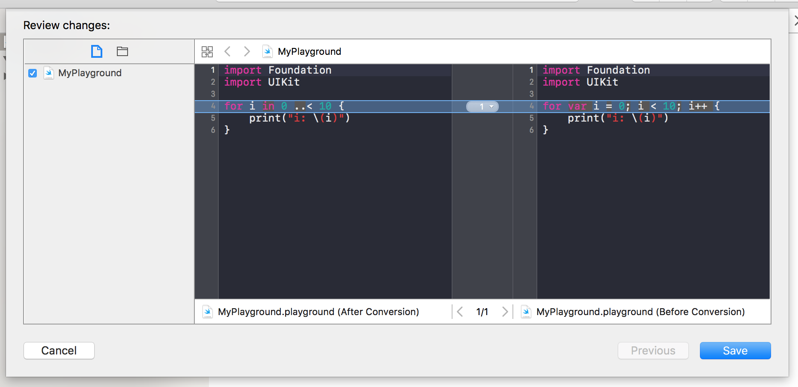

第4回: Swift 3.0でなぜ「Cスタイルのforループ」「`++`・`--`演算子」などの仕様が廃止されたのか

---

先日正式リリースされたSwift 3.0では数多くの変更が含まれたが、今回はその中から廃止となった言語仕様にフォーカスを当てる。

# 仕様廃止のProposal

[第3回](http://www.buildinsider.net/column/ono-masayuki/003)で紹介したSwift Evolutionリポジトリの[Proposalステータスページ](https://apple.github.io/swift-evolution/)を見ると、それぞれのProposalが、未実装・Swift 3.0に実装済み・Swift 2.2に実装済み・後回し・リジェクト済み、のいずれの状態かが分かる。特に、Proposal名に`remove`・`eliminate`など含むものが、仕様廃止系のものである。

<!-- 注: 第2回で「Swiftの変更提案のレビューステータス追跡サイト」と表記しましたが、「Proposalステータスページ」としたいので出来れば第2回の表現も揃えたいです。 -->

## Swift 3.0で廃止された12件の仕様

Swift 3.0で廃止されたのは、以下の12件である。

- [SE-0002: カリー化関数の構文の廃止](https://github.com/apple/swift-evolution/blob/master/proposals/0002-remove-currying.md)
- [SE-0003: 関数引数への`var`指定を廃止](https://github.com/apple/swift-evolution/blob/master/proposals/0003-remove-var-parameters.md)
- [SE-0004: `++`・`--`演算子の廃止](https://github.com/apple/swift-evolution/blob/master/proposals/0004-remove-pre-post-inc-decrement.md)
- [SE-0007: Cスタイルのforループの廃止](https://github.com/apple/swift-evolution/blob/master/proposals/0007-remove-c-style-for-loops.md)
- [SE-0029: タプルを関数引数に与えた時に暗黙的に展開・適用される仕様を廃止](https://github.com/apple/swift-evolution/blob/master/proposals/0029-remove-implicit-tuple-splat.md)
- [SE-0053: 関数引数への`let`明示指定を廃止](https://github.com/apple/swift-evolution/blob/master/proposals/0053-remove-let-from-function-parameters.md)
    - 上述の`SE-0003`の廃止により明示指定の必要性が無くなったため
- [SE-0102: 関数が何も返さないことを保障する`@noreturn`属性が廃止されて、`Never`列挙型を戻り値として指定するように変更](https://github.com/apple/swift-evolution/blob/master/proposals/0102-noreturn-bottom-type.md)
- [SE-0072: Swift標準ライブラリの型とFoundationの型の暗黙的な変換を完全に削除](https://github.com/apple/swift-evolution/blob/master/proposals/0072-eliminate-implicit-bridging-conversions.md)
- [SE-0109: `Boolean`プロトコルの廃止して`Bool`構造体を直接利用するように変更](https://github.com/apple/swift-evolution/blob/master/proposals/0109-remove-boolean.md)
- [SE-0111: 関数の型の一部として関数の引数ラベルを考慮していた仕様を廃止して、型システムをシンプルに](https://github.com/apple/swift-evolution/blob/master/proposals/0111-remove-arg-label-type-significance.md)
- [SE-0121: `<`・`>`・`<=`・`=>`の4つの比較演算子で`Optional`を受けられないように](https://github.com/apple/swift-evolution/blob/master/proposals/0121-remove-optional-comparison-operators.md)
    - ジェネリクスが成熟しないと正確な実装が不可能なため、現状の中途半端な仕様を一旦廃止して、将来の対応に備える(Swift 3.0が破壊的変更をしやすいタイミングのため)
- [SE-0125: `NonObjectiveCBase`クラス・`isUniquelyReferenced`関数の廃止して、`isUniquelyReferencedNonObjC`に統合](https://github.com/apple/swift-evolution/blob/master/proposals/0125-remove-nonobjectivecbase.md)


`SE-0101`・`SE-0109`・`SE-0125`は、言語機能が減るわけでは無く、廃止というより変更とみなすべきかもしれないが、ここでは含めた。こうして見ると、数としては12件と多いがマイナーな言語仕様の変更が多く、通常のアプリケーションコードに対して影響が出そうなのは半分程度であろう。

この中から代表的な2つのProposalをかいつまんで、Swiftコミュニティがどういう考えによってその決定をしたのか詳しく解説する。

# [SE-0004: `++`・`--`演算子の廃止](https://github.com/apple/swift-evolution/blob/master/proposals/0004-remove-pre-post-inc-decrement.md)と[SE-0007: Cスタイルのforループの廃止](https://github.com/apple/swift-evolution/blob/master/proposals/0007-remove-c-style-for-loops.md)を深掘り

特に目を引き、分かりやすいのが、[SE-0004: `++`・`--`演算子の廃止](https://github.com/apple/swift-evolution/blob/master/proposals/0004-remove-pre-post-inc-decrement.md)と[SE-0007: Cスタイルのforループの廃止](https://github.com/apple/swift-evolution/blob/master/proposals/0007-remove-c-style-for-loops.md)の2つである。これらはC言語系の影響を受けた言語、つまり現在使われている多くのプログラミング言語で当たり前のように採用されている仕様である(ちなみに`Python`などはいずれの仕様も無い)。Swift 3.0での廃止の前に、Swift 2.2で先行して非推奨扱い(使用すると警告が発生する)となったが、その時も注目を集めた。

## 廃止による影響の具体例

変数`i`をforループでインクリメントしながら10回出力する簡単なサンプルコードを示す。

Swift 2系まで、以下の書き方も出来た。C言語系のforループと`++`演算子(インクリメント演算子)を組み合わせた馴染みのある書き方である。これが、Swift 3.0ではコンパイルエラーになるように変わる。

```swift
for var i = 0; i < 10; i++ {
    print("i: \(i)")
}
```

まず、`i++`という書き方は出来なくなり、`i += 1`に統一される。

```swift
for var i = 0; i < 10; i += 1 {
    print("i: \(i)")
}
```

さらにforループも以下の書き方に統一されるので、結果以下のようになる。

```swift
// コード例A
for i in 0 ..< 10 {
    print("i: \(i)")
}
```

Swift 2系でもこの書き方は出来た(推奨されていた)ので、「変更」ではなくSwiftらしくない書き方を出来ないように一部の仕様が「廃止」された、ということである。

記事の本筋とは少し逸れるが、以下の書き方も出来る。これは文脈や好み・開発チームのポリシーなどによってどちらを使っても問題無いだろう。

```swift
(0 ..< 10).forEach { i in
    print("i: \(i)")
}
```

## 共通の判断理由

Swiftコミュニティ・コアチームが主に以下など満たすと判断した。

- C言語から何となく持ってきた仕様であり、Swift言語の仕様としてふさわしいか熟考したわけではなかった
- 改めて、その仕様があることのメリット・デメリットを羅列して熟考した結果、デメリットに対してメリットが薄い
    - 今からSwiftを作り直すとしたら、この仕様は入れるべきか？という観点でも検討された
- その仕様が無くとも他の書き方が出来、さらにその他の書き方の方がSwiftらしい書き方である
- 既存のSwiftコードベースへの影響が限定的である
  - 破壊的変更であるので影響は免れないが、利用頻度が少ない・自動変換でカバーするなどで、許容出来るか

特にSwift 3.0を最後の大きな仕様変更としたいという事情もあり、今回こういった不要かもしれない仕様の再検討がなされたのである。

## [SE-0004: `++`・`--`演算子の廃止](https://github.com/apple/swift-evolution/blob/master/proposals/0004-remove-pre-post-inc-decrement.md)について詳しく

`++`演算子について、以下のように宣言した変数`i`を使って説明していく(`--`演算子は単純に逆の挙動なので省略する)。

```swift
var i = 0
````

インクリメントしたい場合、`++`を使うと以下のいずれかで書ける。

```swift
++i // A
i++ // B
```

`++`が使えない場合、以下の書き方になる。

```swift
i += 1
```

いずれの場合も、`i`は1になる。

では、`A`(前置インクリメント演算子)と`B`(後置インクリメント演算子)の違いは何かというと、それぞれ戻り値があるがそれが異なる。`A`ではインクリメントした結果が返り、`B`では先に値を返してからインクリメント処理をする。

```swift
let x = ++i // → x: 1
let y = i++ // → y: 0
```

これらから、`++`・`--`演算子のメリットとして以下が挙げられる。

- うまく使えば、インクリメント処理とその結果返却処理を組み合わせたコンパクトなコードを書ける
- `++`で`+= 1`より短く書ける

一方、それらのメリットについて、以下の指摘も出来る。

- `++`を変数の前か後に置くかという些細な差で挙動が変わるので、可読性低下・バグの要因となることが多い
  - そもそも1つの演算子で、自身の値書き換え・値返却という2つの機能を持つこと自体、良くないのでは？と見ることも出来る
  - 最近は可読性優先の理由などで、前置と後置による挙動の違いを活かしたコードが少なくなってきており、そもそもその差を知らない開発者も存在し、学習コストなどもかかる
- `++`で`+= 1`より短く書けると言っても些細な差である

> そもそも1つの演算子で、自身の値書き換え・値返却という2つの機能を持つこと自体、良くないのでは？と見ることも出来る

この点についてもう少し詳しく書くと、Swiftでは代入演算子は戻り値が`Void`であり、例えば`x += 1`は`Void`を返すし、`x = 1`という単純な代入も`Void`を返す。C系の言語中心にこうなっていないものが多く、例えば`if`文で比較しようとしたが誤って代入してしまいバグの原因になってしまうことがよくある。以下はSwiftではコンパイルエラーとしてくれるが、多くのC系の言語ではifの評価にxの値を使ってコンパイルが通ってしまい、この例の場合、xへ1を代入・if文内の処理のいずれも必ず実行されてしまう。

```swift
var x = 0
if x = 1 { // Swiftではここでコンパイルエラーが発生して、本来`x == 1`と書くべきだったと気付ける
    print("x: \(x)")
}
```

代入演算子の処理結果が`Void`を返すようにすると、こういったバグを防げるとともに、有する機能が1つとシンプルになる。上述の通りSwiftの代入演算子は`++`・`--`以外はそうなっているので、この2つの演算子を廃止する(戻り値を返さないようにするという別案もあったが)と、言語の一貫性も向上する。

このように、今まで当たり前のように使っていた`++`・`--`演算子を見直すと、メリットどころかデメリットの方が多いのではと思えてくる。「`++`で`+= 1`より短く書ける」というのは確かにそうなのだが、これらのデメリットと比べてその恩恵は小さく、この言語仕様は不要という判断がなされたのである。

また、`++`・`--`は、次に述べるCスタイルのforループ内で頻繁に利用されていたが、それが廃止になることもこの判断の追い風になった。

## [SE-0007: Cスタイルのforループの廃止](https://github.com/apple/swift-evolution/blob/master/proposals/0007-remove-c-style-for-loops.md)を詳しく

Cスタイルのforループ廃止は、`コード例A`のような書き方が出来るにも関わらず、冗長な文法を残しておくメリットが薄い、という一言に尽きる。Cスタイルのforループを使いたい、という意見は基本的にその書き方に慣れているということが理由であろう。逆に、初学者に取っては、`コード例A`のような書き方のみ出来るようにしていた方が学習コストも低く混乱も防げる。

さらに、`コード例A`のような書き方では少し冗長になってしまいそうな以下の例についても問題無い。

```swift
for var i = 0; i < 10; i += 2 {
    print("i: \(i)")
}
```

Swiftには`stride`関数が用意されていて、次のように書ける。

```swift
for i in stride(from: 0, to: 10, by: 2) {
    print("i: \(i)")
}
```
`stride(from: 0, to: 10, by: 2)`は、`0..<10`で`by`で指定された2ずつ飛ばしたSequenceを返すので、ここでは`[0, 2, 4, 6, 8]`という配列相当になる。
(`to`引数を`thurough`にすると、範囲が`0...10`となり`[0, 2, 4, 6, 8, 10]`相当になる。)

`filter`メソッドや`where`句などを組み合わせてより複雑な条件も指定でき、大抵のケースでCスタイルのforループより簡潔かつ分かりやすく書ける。

ここまではProposalをかみ砕いたような内容だったが、ここから筆者の考察を交えながら述べていく。

## 同じ処理を複数の書き方が出来てしまうことについて

「メリットが薄いと言ってもせっかく今備わっている機能なのだから残しておいても良いのでは？」という意見もあるだろう。しかし、複数の書き方がありつつも、Swiftとしてどちらの書き方を推奨されているかが明確であれば、結局推奨されない書き方の使いどころが無くなってしまう。ベターな書き方に揃えるために、コード規約・レビュー・`Lint`ツールなどで推奨される方に揃える労力なども発生するので、コンパイルエラーで正してくれた方がむしろ楽である。

また、仕様はシンプルなほど、Swift言語自体の開発もしやすいという面もある。一応残しておいた仕様が足かせになって本来入れたい言語機能実装に苦労するのはとてももったいない。

## 既存コードへの影響

当然、廃止される構文を使っていた場合、コンパイルエラーが発生してしまう。ただ、Xcodeの自動変換機能での補助を受けられる。

個別のコンパイルエラー指摘とともに自動変換を促す機能:


プロジェクト単位で一括して自動変換する機能:



### 自動変換OKの例

以下の2つのような単純な利用であれば、Xcodeで自動変換対応してくれる。

```swift
var i = 0
i++ // `i += 1`に自動変換
```

```swift
for var i = 0; i < 10; i++ { // `コード例A`へ自動変換
    print("i: \(i)")
}
```

### 自動変換NGの例

次の処理は自動変換で対応出来ない。

```swift
var i = 0
let x = i++
```

次のように変換されるが、`x`は変換前は`1`だったのが変換後は`Void`になってしまう(型が異なるので、バグにはならずに後続の処理がコンパイルエラーになるだろう)。

```swift
var i = 0
let x = i += 1
```

先ほどの`stride`の例でだしたCスタイルのforループも自動変換で対応出来ない。

```swift
for var i = 0; i < 10; i += 2 {
    print("i: \(i)")
}
```

`C-style for statement has been removed in Swift 3`とコンパイルエラーメッセージが表示されるのみである。ここは技術的には変換可能であるが細かいところまでカバーするとキリが無いので単純なforループのみの対応にとどめた、ということであろう。


ちなみに、この自動変換処理もSwiftリポジトリに含まれているため、「変数の初期値と終点値が定まっていて、1ずつインクリメントかデクリメントしていくのみの単純なforループ」の時のみ効くということが分かる。

```cpp
VarDecl *loopVar = dyn_cast<VarDecl>(initializers[1]);
Expr *startValue = loopVarDecl->getInit(0);
OperatorKind OpKind;
Expr *endValue = endConditionValueForConvertingCStyleForLoop(FS, loopVar, OpKind);
bool strideByOne = unaryIncrementForConvertingCStyleForLoop(FS, loopVar) ||
            plusEqualOneIncrementForConvertingCStyleForLoop(TC, FS, loopVar);
bool strideBackByOne = unaryDecrementForConvertingCStyleForLoop(FS, loopVar) ||
            minusEqualOneDecrementForConvertingCStyleForLoop(TC, FS, loopVar);

if (!loopVar || !startValue || !endValue || (!strideByOne && !strideBackByOne))
return;
```
https://github.com/apple/swift/blob/master/lib/Sema/MiscDiagnostics.cpp#L2925-L2935

さらに余談になるが、これは[[SR-226] Implement warning about the use of C-style for loops in Swift 2.2 - Swift](https://bugs.swift.org/browse/SR-226)にて起票され、[[SR-226] Deprecation of C-style for loops by gregomni · Pull Request #552 · apple/swift](https://github.com/apple/swift/pull/552)のプルリクエストで実際にコード対応された、という流れまで追うことが出来る。Swiftがオープンソース化されたことで、このように隅々まで深掘り出来るようになったのである。

### そもそも廃止される構文の利用が少ない

Xcodeによる、廃止された構文の自動変換対応について書いたが、そもそもそもそも廃止される構文の利用が少ないということもある。`++`・`--`については、副作用の少ないコードを心がけていると使っていた箇所は、戻り値不使用の単純なインクリメント・デクリメント処理にとどまり、自動変換OKの例に該当するだろう。

Cスタイルのforループに関しては、Proposalでも指摘されているとおり、Swiftのコードベースでの利用例が極めて稀である。筆者もSwiftではこれまで一度も書いたことが無い。もし既存コードでうっかり書いてしまっていたところがあっても、Swiftらしいコードに正せる良い機会と思いながら寄りそうのが、Swiftとうまく付き合うコツであると感じる。

# リジェクト・先送りになった仕様廃止系のProposal

ここまでSwift 3.0で廃止になる仕様12個を挙げてそのうち2つについて詳しく見てきたが、もちろん仕様を廃止してシンプルにすることが正義なわけではなく、慎重な議論の末にリジェクト・先送りになったProposalもあるので簡単に紹介する(そもそもProposalはメーリングリストなどでの充分な議論をくぐり抜けてきたものであり、実際の提案数自体はさらに多い)。

## リジェクトされた仕様廃止系のProposal

リジェクトされた仕様廃止系のProposalは次の4件である。

- [SE-0013: 非`final`の親メソッドの部分適用の廃止](https://github.com/apple/swift-evolution/blob/master/proposals/0013-remove-partial-application-super.md)
- [SE-0105: forループの`where`句の廃止](https://github.com/apple/swift-evolution/blob/master/proposals/0105-remove-where-from-forin-loops.md)
- [SE-0108: プロトコルの`associatedtype`推論を廃止](https://github.com/apple/swift-evolution/blob/master/proposals/0108-remove-assoctype-inference.md)
- [SE-0119: `extension`からアクセス修飾子を廃止](https://github.com/apple/swift-evolution/blob/master/proposals/0119-extensions-access-modifiers.md)

リジェクトの判断理由は、それぞれのProposalの`Decision Notes: Rationale`のリンク先にて、採択されたProposalとは逆に、`廃止するための労力・仕様があることのメリット` > `廃止するメリット`とみなした理由が記述されている。明確なリジェクト判断が下されたので、その理由が覆されるような新たな発見などが無い限り、蒸し返されることも無く、今後Swiftのこの仕様は残り続けるはずである。

## 先送りになった仕様廃止系のProposal

リジェクトされた仕様廃止系のProposalは次の2件である。

- [SE-0083: 動的なキャスト機能からCocoa API・Swift間のブリッジを削除してイニシャライザー形式に変更](https://github.com/apple/swift-evolution/blob/master/proposals/0083-remove-bridging-from-dynamic-casts.md)
    - 採用された[SE-0072: Swift標準ライブラリの型とFoundationの型の暗黙的な変換を完全に削除](https://github.com/apple/swift-evolution/blob/master/proposals/0072-eliminate-implicit-bridging-conversions.md)と関連して、Objective-Cの`id`型周りで問題が発生するため、この解決を練る必要がある
- [SE-0090: 型を参照する際の`.self`の廃止および、利用箇所で`.self`指定無しで型推論で解決](https://github.com/apple/swift-evolution/blob/master/proposals/0090-remove-dot-self.md)

提案自体は妥当だが、時間や技術的な課題がありSwift 3.0に含めることは出来ない、と判断されたものである。こちらはその解決がされ次第、将来のバージョンに入る可能性が高い。

# まとめ

今回は、Swift 3.0の廃止系の変更について紹介し、特に目立つ[SE-0004: `++`・`--`演算子の廃止](https://github.com/apple/swift-evolution/blob/master/proposals/0004-remove-pre-post-inc-decrement.md)と[SE-0007: Cスタイルのforループの廃止](https://github.com/apple/swift-evolution/blob/master/proposals/0007-remove-c-style-for-loops.md)について深掘りして、Swiftの言語開発がどのような考えでなされているのかを解説した。一見大胆な仕様変更に見えたかもしれないが、こうやって見ると納得感が出てきたのではなかろうか。なぜこの仕様になったのだろう？などと気になることがあったら、Proposalを自ら読み解いていくと色々発見があってお勧めである。