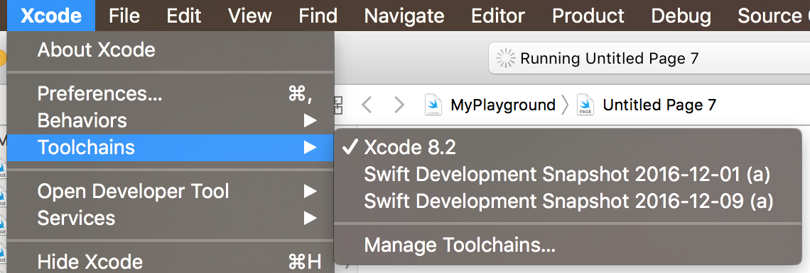

タイトル(仮): Swift 3.1 のリリースプロセスおよびそれに含まれる変更内容の紹介(前編)

---

現時点での Swift の正式最新版は 3.0.2 であり、着々と次期バージョンの開発が進んでいる。また、12月9日に Swift 3.1 のリリースプロセスの公式アナウンスもあった。今回は現在進行している Swift の開発状況、および Swift 3.1 に含まれる変更内容などを紹介していく。


# [Swift 3.1 Release Process](https://swift.org/blog/swift-3-1-release-process/) の紹介

12月9日に [Swift 3.1 Release Process](https://swift.org/blog/swift-3-1-release-process/) という Swift 3.1 リリースプロセスの公式アナウンスがあったので紹介する。

## Swift 3.1 のリリース予定時期

Swift 3.1 のリリース予定時期は、2017年春とのことである。過去のリリース日については [Swift 3のリリース前に、これまでの進化の変遷をなぞる - Build Insider](http://www.buildinsider.net/column/ono-masayuki/001) で列挙したが、1系と2系の大きめのアップデート日は次のようになっていた。

- Swift 1.2/Xcode 6.3: 2015年4月8日
- Swift 2.2/Xcode 7.2: 2015年3月21日

Swift 3.1 についてもこのあたりの時期に新しいバージョンの Xcode(おそらく Xcode 8.3)と同時にリリースされるはずである。

## ソースコードの互換性

### Swift 3.0 を境にソースコード互換性が大きく向上し、 3.1 対応では基本的にコードの変更不要になる

Swift はこれまでアップデートの度に破壊的変更が続いていて、マイナーアップデートでも毎度必ず破壊的変更を含んでおり、特に 3.0 は過去最大の変更量になったため苦労させられた開発者も多かったが、3.0 を境に大きく安定化している。3.0.1・3.0.2 、ともに 3.0 で書かれたコードがそのままコンパイル出来るが、 3.1 でも同じく基本的にコードの変更無くコンパイル出来る予定である。ただ、これまで意図せずコンパイルが通ってしまっていたものを正すコンパイラーのバグフィックスは含まれる。もしその影響を受けるようなコードが書かれていた場合コンパイルエラーになってしまうが、これもかなり限定的でほとんどのプロジェクトは 3.0 から一切のコードの変更無く 3.1 でコンパイルが通るはずである。

つまり、Swift 3.1 はソースコード互換性について注力された初のマイナーアップデートであり、Chris Lattner氏も次のように言及している。

<blockquote class="twitter-tweet" data-lang="en"><p lang="en" dir="ltr">Swift 3.1 is the first release to benefit from the new era of source compatibility, a result of swift-evolution refining and polishing 3.0! <a href="https://t.co/B3nNYABM3H">https://t.co/B3nNYABM3H</a></p>&mdash; Chris Lattner (@clattner_llvm) <a href="https://twitter.com/clattner_llvm/status/807368728048324608">December 9, 2016</a></blockquote> <script async src="//platform.twitter.com/widgets.js" charset="utf-8"></script>

### Swift 4 でのソースコード互換性

Swift 3.1 の話から少し脱線するが、4.0 でのソースコード互換性についても触れておきたい。4.0 に向けても互換性は大事にされていくが、多少の破壊的変更が含まれてしまうことが予定されている(とはいえ、3.0 の時の変更に比べると遙かに少なく済むはずである)。また、 [SR-2582: Add -swift-version command line flag](https://bugs.swift.org/browse/SR-2582) の対応により、Swift 4 のコンパイラーは、フラグを指定することでSwift 3 のコードのままコンパイルも可能となる。

- `-swift-version 3`: Swift 3 のコードのままコンパイル可能とするフラグ
- `-swift-version 4`: Swift 4 非互換の書き方がなされていた場合、コンパイルエラーとなる(無指定の場合と同じ)

つまり、Swift 4 では 3.0 までと比べて破壊的変更が限定的になることに加えて、上記フラグを使うことでその変更追従も先送り出来るようになる予定である。Xcode 8.0 以上から Swift 3系が標準となったものの、移行措置としてXcode 8.2 まで Swift 2.2 と互換性の高い 2.3 を使えるが、それと似たような対応が Swift のコンパイラーレベルでなされたとも言える。

また、 `-swift-version 3` でビルドしたモジュールと `-swift-version 4` でビルドしたモジュールは、同じSwift 4のコンパイラーによって生成したモジュールなので、お互いリンク可能である。例えば、次のようなことも出来るので、これまで Swift のバージョンアップ時に足かせになっていた、古いバージョンの Swift で書かれたライブラリの扱いがかなり楽になるはずである(これまでは対応されるのを待つか、自らFork・Pull Requestなどして対応する必要があった)。

- Swift 4対応済みで `-swift-version 4` にてビルド済みのライブラリを、 `-swift-version 3` 設定のプロジェクトで利用可能
- Swift 4未対応のライブラリを `-swift-version 3` にてビルドして、それを Swift 4対応済みで `-swift-version 4` 設定のプロジェクトにて利用可能

上記の Swift のソースコード互換性およびそれに対する考えは、[[swift-evolution] Details of what source compatibility with Swift 3 means](https://lists.swift.org/pipermail/swift-evolution/Week-of-Mon-20161128/029099.html) に詳細に書かれている。

## Swift 3.1 beta版の配布法

これまでの開発中の Swift は、ある程度安定したタイミングで定期的に [Preview版](https://swift.org/download/#previews) として配布してきたが、3.1 の開発中はそれをせずに [Snapshots版](https://swift.org/download/#snapshots) としてのみ配布していくとのことである。Preview版として配布していくやり方では、しばしば不定期に配布のタイミングが大きく空いてしまうことがあったため、新しい機能の仕様・バグ修正確認などのフィードバックサイクルがうまく回りにくかった、などの問題があったことが挙げられている。

Snapshots版は、[継続的インテグレーションの仕組み](https://ci.swift.org)の上で出力されており高い頻度で自動的に更新されていくので、それを利用して開発版最新の Swift を試していける。また、Snapshots版は 300MBほどと比較的軽量(Xcode版Snapshotsの場合)なので、 4.5GB程度とサイズの大きな Xcode 本体と比べて気軽に更新可能である。

## Swift 3.1 〜 4 の開発プロセス

2017年の早いうちに Swift 4 の開発にシフトしたいため、 3.1 はスコープの限られた変更となる。2016年1月16日までは `master` ブランチで開発を続け、それ以降は `swift-3.1-branch` ブランチにて 3.1 の正式版リリース品質に仕上げるためのクリティカルな修正作業にフォーカスする予定である。このタイミングで `master` ブランチは Swift 4 開発用となるため、Swift 3.2 はリリースされずに 3.1 系のマイナーアップデート程度にとどまるであろう。

<!-- ↓### などで見出し入れるか、入れ子の箇条書きにするかなども迷いつつ… -->

2016年1月16日まで:

- `master`ブランチ: Swift 3.1 開発
- `swift-3.1-branch` ブランチ: 隔週で `master` ブランチがマージされる

2016年1月16日以降:

- `master`ブランチ: Swift 4 開発
- `swift-3.1-branch` ブランチ: Swift 3.1 リリース向けての開発

[Swift 3.1 Release Process](https://swift.org/blog/swift-3-1-release-process/) の後半には、Swift 3.1 開発に向けての Pull Request の仕方などが載っているが、本記事では割愛する。

# Snapshots版 Swift の利用法

上で Swift 3.1 を今試してみるには Snaphots版 を使う必要があることを述べたが、ここでは macOS でそれを利用する方法を紹介しよう。

まずは、[Snapshots版](https://swift.org/download/#snapshots)をダウンロード・インストールする。

すると、`/Library/Developer/Toolchains/` 配下に `swift-DEVELOPMENT-SNAPSHOT-2016-12-09-a.xctoolchain` のような toolchain ディレクトリが配置されるとともに、Xcode アプリ上で Toolchains メニューから選択出来るようになる。



Xcode 上で Snapshots版の Swift を使いたい場合は、ここから選ぶだけで良い。ただ、試したあと、元の正式版に戻しておかないと通常の開発時のトラブルの原因になりかねないので、注意が必要である。

コマンドライン上で使いたい場合は、いくつか方法がある。

## 方法1: パスを通す

上で、`/Library/Developer/Toolchains/` 配下に配置されると書いたが、`swift-latest.xctoolchain` というシンボリックリンクが最新版を指しているので、次のようにすればパスを通せる。


```
$ export PATH=/Library/Developer/Toolchains/swift-latest.xctoolchain/usr/bin:"${PATH}"
```

もちろん、任意の古いSnapshots版を使いたい場合は、シンボリックリンクではなく明示的にその版の指定が必要である。

## 方法2: 環境変数 `TOOLCHAINS` に `swift` をセットする

次のコマンドだけでSnapshots最新版を使えるようになる。

```
$ export TOOLCHAINS=swift
```

## 方法3: [kylef/swiftenv: Swift Version Manager](https://github.com/kylef/swiftenv) を利用

[kylef/swiftenv](https://github.com/kylef/swiftenv) を使うことで [rbenv](https://github.com/rbenv/rbenv)・[pyenv](https://github.com/yyuu/pyenv) と同じ感覚で、複数のSwiftバージョンを使い分けることが出来るようになる。Snapshot版だけでなく、複数のXcode同梱のSwiftのバージョンの切り替え(通常、XcodeアプリのGUIで切り替え・`sudo xcode-select -s`コマンド・`DEVELOPER_DIR`環境変数セット、のいずれかの操作が必要)にも対応していて便利である。

[Homebrew](http://brew.sh) でインストールし、`swiftenv` をロードするように `bash_profile` などに設定を記述すれば使えるようになる。

```sh
$ brew install kylef/formulae/swiftenv
$ echo 'if which swiftenv > /dev/null; then eval "$(swiftenv init -)"; fi' >> ~/.bash_profile
```

例えば、そのディレクトリでは特定のSnapshot版を使いたい場合は次のように使う。

```sh
$ swiftenv local DEVELOPMENT-SNAPSHOT-2016-12-09-a
$ cat .swift-version 
→ DEVELOPMENT-SNAPSHOT-2016-12-09-a
$ swift --version
→ Apple Swift version 3.0-dev (LLVM eb108553a5, Clang 94b9e5191c, Swift df7ad7cb12)
Target: x86_64-apple-macosx10.9
```

便利ではあるものの、公式のやり方では無いのでその点の注意は必要である。副作用など気になってやはり `swiftenv` を消したくなることもありえると思うが、その場 `bash_profile` に記述した設定を削除し、次のコマンド実行でアンインストール出来る。

```
$ rm -fr ~/.swiftenv
$ brew uninstall swiftenv
```
後編では、Swift 3.1 に含まれる変更内容を、上で説明したSnapshots版で試しながら説明していく。